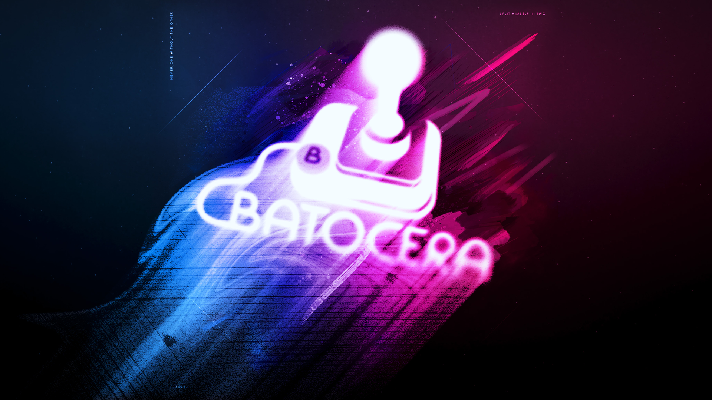
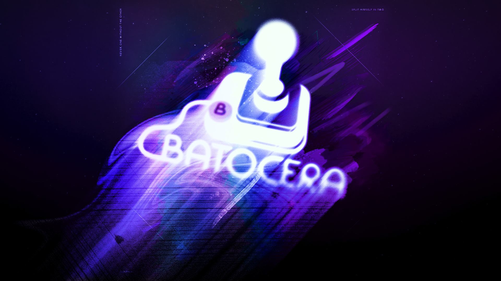
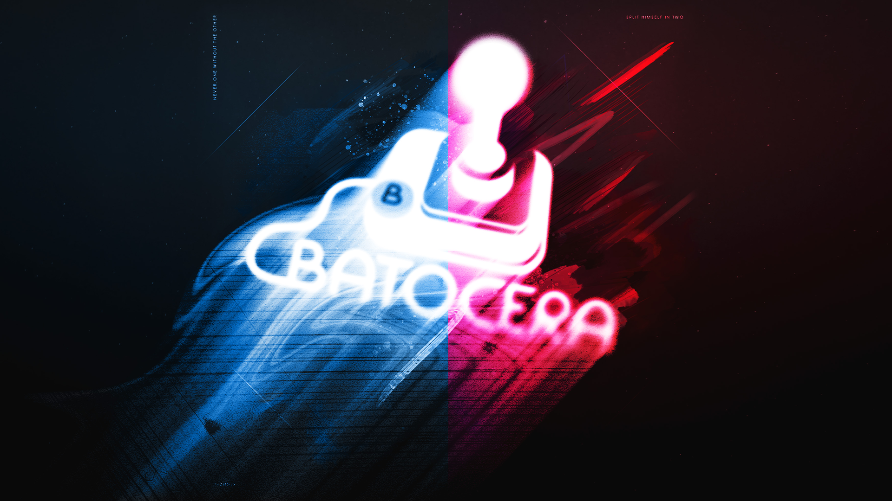
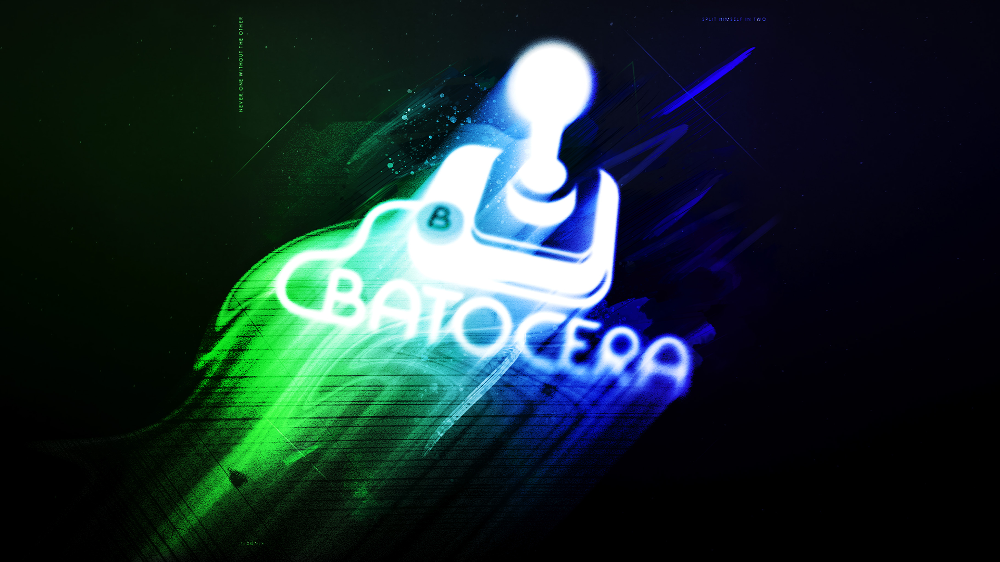
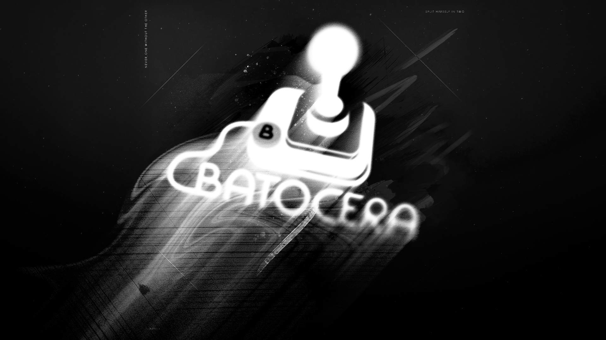
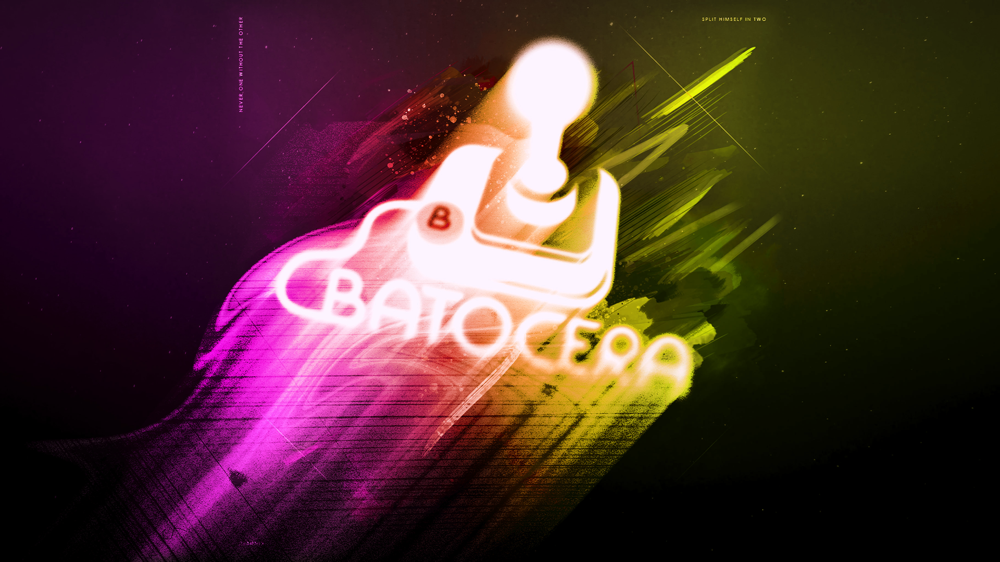
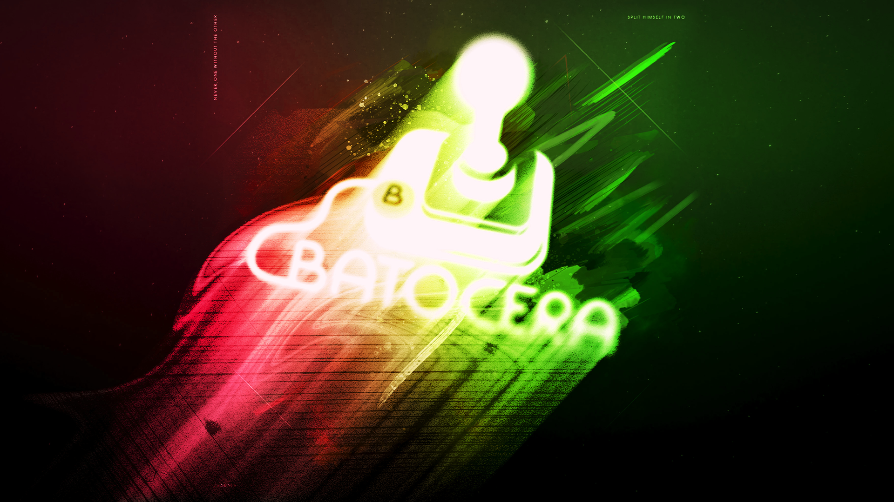
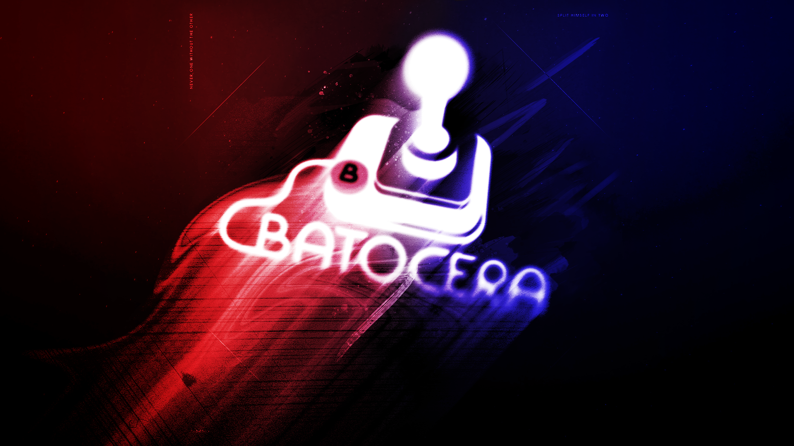
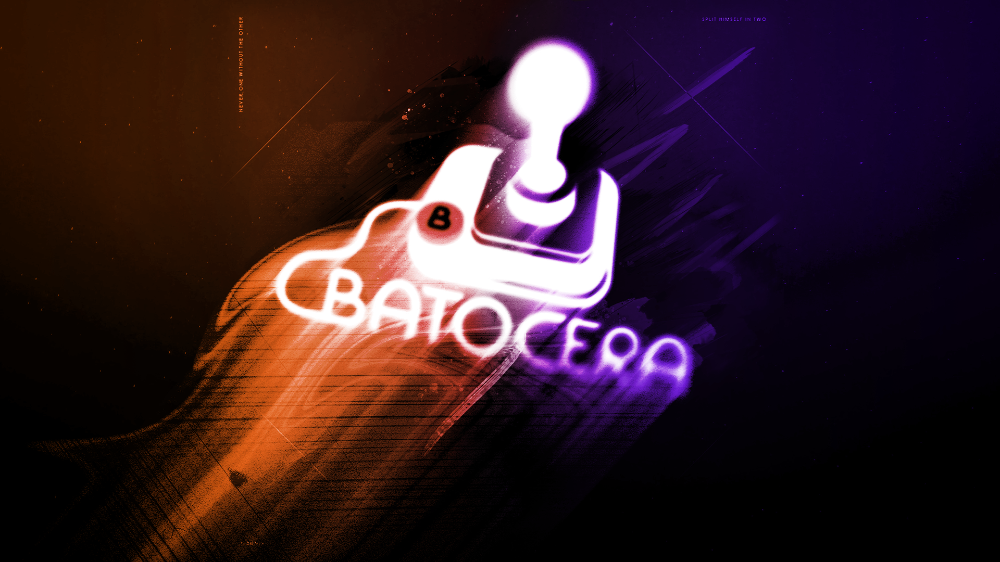

# Batocera Pulse Wallpaper Pack

A custom collection of 10 high-quality wallpapers designed specifically for the **Batocera.linux** community and Batocera Pulse Theme. 
This pack features a vibrant, colorful "glitchy" art style, perfect for modern retro-gaming setups.

---

## Preview Gallery

Below you can find a preview of the 10 wallpapers included in this pack.

---

## Installation & Usage

1. **Download:** Go to the [Releases](https://github.com/complicatiion/batocera_pulse_wallpaper) section and download the latest `.zip` file.
2. **Batocera Integration:** - Copy the files to your Batocera `/userdata/screenshots/` or directly into your custom theme folder under `/assets/wallpapers/`.
   - Select the wallpaper via the UI settings in your theme menu.

---

## License & Credits

### Ownership
All artworks were created by **complicatiion | sven404 | sksdesign**. This pack is an independent contribution to the Batocera community.

### Terms of Use
This project is licensed under the **Creative Commons Attribution-NonCommercial-ShareAlike 4.0 International (CC BY-NC-SA 4.0)**.
- **Personal Use:** Highly encouraged for the Batocera community!
- **Commercial Use:** Strictly prohibited. You may not sell this pack or include it in paid commercial handheld images/builds.

### Disclaimer
This project is **not** affiliated with, authorized, or endorsed by the official **Batocera.linux** team. "Batocera" is a trademark of its respective owners.

Copyright (c) 2026 complicatiion | sven404 | sksdesign

---
*Created with ❤️ for the Batocera Community.*
